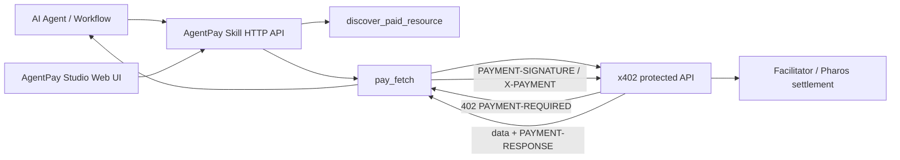

# Pharos AgentPay x402 Skill Suite

Reusable **Skill Suite for AI Agents to pay for HTTP APIs with x402 on Pharos**. It is built for the Pharos Skill-to-Agent Dual Cascade Hackathon Phase 1: agents can discover a paid resource, evaluate the price, create a payment, fetch the protected data, and return a receipt that another agent workflow can verify or store.

- Hackathon fit: Skill modules for the Pharos AI Agent economy
- Payment rail: x402 over HTTP 402 Payment Required
- Network default: Pharos Atlantic Testnet, `eip155:688689`
- Demo modes: reliable local mock mode + real Pharos testnet mode when wallet/facilitator/token env is available
- Product UI: **AgentPay Studio** web dashboard for judges to run the agent payment workflow visually

References: [Pharos x402 docs](https://docs.pharosnetwork.xyz/resources/x402), [Pharos network info](https://docs.pharosnetwork.xyz/network-overview/pharos-networks), [x402](https://github.com/coinbase/x402).

## Architecture



## What is included

### Skill HTTP Server

| Endpoint | Purpose |
| --- | --- |
| `GET /skills/catalog` | Lists reusable AgentPay skills and network defaults. |
| `POST /skills/discover` | Probes a URL and extracts x402 payment requirements from a 402 response. |
| `POST /skills/pay-fetch` | Pays for and fetches a protected resource in `mock` or `real` mode. |
| `POST /skills/decode-receipt` | Decodes a `PAYMENT-RESPONSE` header into JSON. |

### Demo Paid API Server

| Endpoint | Price | Purpose |
| --- | ---: | --- |
| `GET /health` | Free | Health check. |
| `GET /catalog` | Free | Lists paid demo endpoints. |
| `GET /alpha/rwa` | `0.003 USDC` | Premium RWA alpha signal. |
| `POST /research/summarize` | `0.005 USDC` | Paid research summarization. |

### Optional Facilitator

| Endpoint | Purpose |
| --- | --- |
| `GET /supported` | Supported x402 schemes/networks. |
| `POST /verify` | Verify payment payload. |
| `POST /settle` | Settle payment and return transaction receipt. |

## Quick start: mock mode, no wallet required

```bash
npm install
npm run build
npm test
npm run demo:mock
```

The mock demo starts a demo paid API and the Skill HTTP server on random local ports, then performs this agent story:

1. Agent needs paid RWA alpha.
2. Agent calls `POST /skills/pay-fetch`.
3. Skill receives HTTP 402 payment requirements.
4. Skill creates a mock x402 payment payload.
5. Demo API returns premium data plus a `PAYMENT-RESPONSE` receipt.
6. Demo repeats the same idempotency key to prove no duplicate mock charge is created.

## AgentPay Studio web UI

Run the full local product demo with one command:

```bash
npm run studio
```

Then open:

```text
http://localhost:4020/studio/
```

AgentPay Studio starts the Skill server on `4020` and the paid demo API on `4021`, then gives judges a visual workflow:

- choose the paid RWA alpha or research summarizer endpoint;
- click **Discover 402** to inspect x402 payment requirements;
- set `maxUsd` and an idempotency key;
- click **Pay & fetch** to unlock premium data;
- inspect the normalized receipt in the Receipt Vault.

## CLI usage

```bash
npm run agentpay -- catalog
npm run studio
npm run agentpay -- studio --mode mock --skill-port 4020 --demo-port 4021
npm run agentpay -- demo --mode mock
npm run agentpay -- serve-skills --mode mock --port 4020
npm run agentpay -- serve-demo-api --mode mock --port 4021
npm run agentpay -- discover http://localhost:4021/alpha/rwa
npm run agentpay -- pay-fetch http://localhost:4021/alpha/rwa --max-usd 0.01 --mode mock --idempotency-key demo-1
npm run agentpay -- pay-fetch http://localhost:4021/research/summarize --method POST --body '{"prompt":"Why x402 for Pharos agents?"}' --max-usd 0.01 --mode mock
```

After `npm run build`, the binary target is `dist/cli.js` and the package exposes `agentpay` via `package.json#bin`.

## Skill API examples

Start servers in separate terminals:

```bash
npm run serve:demo-api
npm run serve:skills
```

Discover a protected resource:

```bash
curl -s http://localhost:4020/skills/discover \
  -H 'content-type: application/json' \
  -d '{"url":"http://localhost:4021/alpha/rwa","method":"GET"}' | jq
```

Pay and fetch:

```bash
curl -s http://localhost:4020/skills/pay-fetch \
  -H 'content-type: application/json' \
  -d '{
    "url":"http://localhost:4021/alpha/rwa",
    "method":"GET",
    "mode":"mock",
    "maxUsd":0.01,
    "idempotencyKey":"agent-demo-001"
  }' | jq
```

## Public JSON interfaces

### `PayFetchInput`

```json
{
  "url": "http://localhost:4021/alpha/rwa",
  "method": "GET",
  "headers": {},
  "body": null,
  "maxUsd": 0.01,
  "mode": "mock",
  "idempotencyKey": "agent-demo-001"
}
```

### `PayFetchResult`

```json
{
  "ok": true,
  "status": 200,
  "data": { "signal": "..." },
  "paymentRequired": { "x402Version": 2, "accepts": [] },
  "receipt": {
    "network": "eip155:688689",
    "transaction": "mock:...",
    "payer": "agentpay-mock-wallet",
    "amount": "3000",
    "success": true,
    "mode": "mock"
  }
}
```

## Real Pharos testnet mode

Copy the example env and fill real values:

```bash
cp .env.example .env
```

Required for buyer/client real mode:

```bash
EVM_PRIVATE_KEY=0x...
```

Required for seller/demo API real mode:

```bash
PAY_TO_ADDRESS=0xYourReceivingAddress
FACILITATOR_URL=http://localhost:4023
USDC_ADDRESS=0xE0BE08c77f415F577A1B3A9aD7a1Df1479564ec8
```

Then run:

```bash
npm run agentpay -- serve-facilitator --mode real --port 4023
npm run agentpay -- serve-demo-api --mode real --port 4021
npm run agentpay -- pay-fetch http://localhost:4021/alpha/rwa --max-usd 0.01 --mode real
```

Notes:

- Never paste or commit private keys. Use `.env` or your shell environment.
- The default test USDC address follows the Pharos x402 docs and is configurable because it is not an official production token.
- Real mode is intentionally optional for Phase 1. Mock mode is deterministic for judges and CI; real mode demonstrates the path to Pharos settlement.

## Environment variables

See `.env.example`. Important defaults:

```bash
PHAROS_NETWORK=eip155:688689
PHAROS_CHAIN_ID=688689
PHAROS_RPC_URL=https://atlantic.dplabs-internal.com
USDC_ADDRESS=0xE0BE08c77f415F577A1B3A9aD7a1Df1479564ec8
MAX_USD_DEFAULT=0.01
```

## Why this is reusable for agents

- **Composable**: any agent can call the HTTP Skill API or CLI.
- **Safe by default**: `maxUsd` guard blocks unexpected expensive resources.
- **Idempotent**: `idempotencyKey` prevents duplicated mock charges and models retry-safe payments.
- **Receipt-oriented**: every paid response returns a normalized receipt for downstream agent memory, audit, or reputation systems.
- **Chain-aligned**: real mode uses x402 V2, EVM exact scheme, Pharos network identifier `eip155:688689`, and configurable facilitator.
